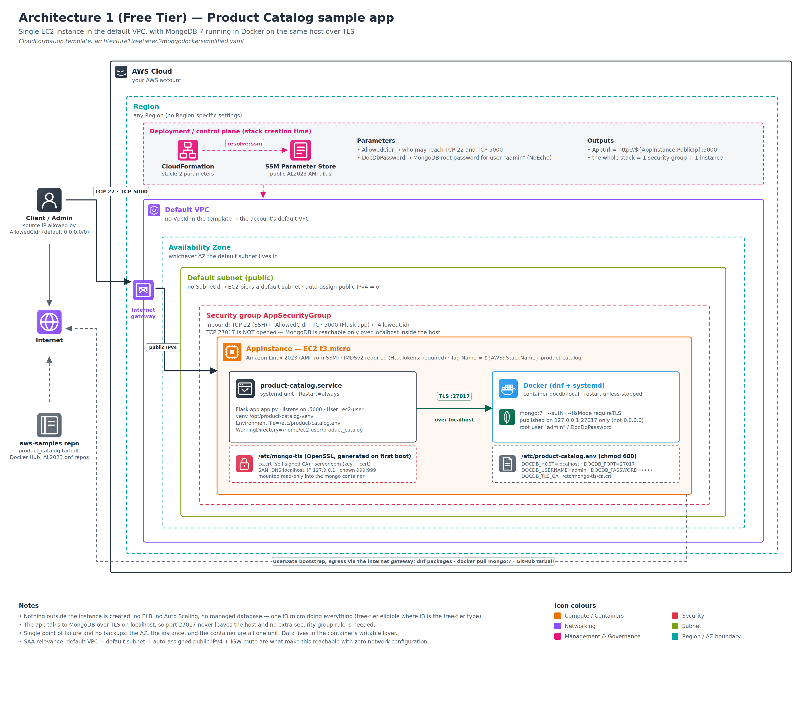

# ARCHITECTURE 1 - ALL RUNNING ON EC2 WITH MONGODB ON DOCKER (FREE)

The diagram bellow shows the details about the *Architecture 1* which is all self-contained in a single EC2 instance running MongoDB on Docker to avoid using DocumentDB and so keeping it on free tier.



## AUTOMATIC DEPLOY WITH CLOUD FORMATION

Use the template file [archtecture1-freetier-ec2-mongo-docker-simplified](templates/archtecture1-freetier-ec2-mongo-docker-simplified.yaml) on AWS Cloud Formation to automatically create the server. 

There is also another template [archtecture1-freetier-ec2-mongo-docker](templates/archtecture1-freetier-ec2-mongo-docker.yaml) which provides more control over VPC, Subnet, and instance type.


## MANUAL DEPLOY

To deploy this architecture manually just create an EC2 Linux instance on AWS, connect to it and follow the steps bellow.

### ENVIRONMENT SETUP
```
export APP_INSTALL_FOLDER=~/product_catalog
export DOCDB_HOST="localhost"
export DOCDB_PORT="27017"
export DOCDB_USERNAME="admin"
export DOCDB_PASSWORD="localdev123"
export DOCDB_TLS_CA=$APP_INSTALL_FOLDER/mongo-tls/ca.crt

```
### INSTALL DEPENDENCIES

1. Install pip and python

`sudo yum install pip`

2. Install docker

`sudo yum install docker`

3. Enable docker auto start at boot

`sudo systemctl enable --now docker`

### INSTALL THE APP

1. Download the code

Create a folder for the app

`mkdir -p $APP_INSTALL_FOLDER`

Download the code from GitHub

`curl -L https://github.com/aws-samples/amazon-documentdb-samples/archive/refs/heads/master.tar.gz | tar -xz -C $APP_INSTALL_FOLDER --strip-components=3 amazon-documentdb-samples-master/usecases/product_catalog`

2. Install the requirements

`pip install -r requirements.txt`

### DATABASE MANUAL DEPLOY

#### CERTIFICATION CREATE STEP BY STEP

1. Create a folder to install the certification files

```
mkdir $APP_INSTALL_FOLDER/mongo-tls
cd $APP_INSTALL_FOLDER/mongo-tls
```

2. Create the Certificate Authority (CA) certificate.

`openssl req -x509 -newkey rsa:2048 -days 3650 -nodes \
  -keyout ca.key -out ca.crt -subj "/CN=local-docdb-ca"`

3. Create a private key and certificate request (CSR)

`openssl req -newkey rsa:2048 -nodes \
  -keyout private.key -out cert_request.csr -subj "/CN=localhost"`

4. Creates a configuration file

`cat > ext.cnf <<'EOF'
subjectAltName = DNS:localhost,IP:127.0.0.1
basicConstraints = critical,CA:FALSE
keyUsage = critical,digitalSignature,keyEncipherment
extendedKeyUsage = serverAuth
EOF`

5. Sign the certificate and create the certificate

`openssl x509 -req -in cert_request.csr -CA ca.crt -CAkey ca.key -CAcreateserial \
  -out server.crt -days 825 -sha256 -extfile ext.cnf`

6. Create PEM file with private and public keys
cat private.key server.crt > server.pem

#### CREATE DOCKER INSTANCE WITH MONGODB

1. Add permission to ec2-user to run Docker

`sudo usermod -aG docker ec2-user`

Login again or run:

`newgrp docker`

2. Create a docker instance with MongoDB

```
docker run -d --name docdb-local \
  -p 27017:27017 \
  -e MONGO_INITDB_ROOT_USERNAME=$DOCDB_USERNAME \
  -e MONGO_INITDB_ROOT_PASSWORD=$DOCDB_PASSWORD \
  -v $APP_INSTALL_FOLDER/mongo-tls:/etc/mongo-tls:ro \
  mongo:7 \
  --auth --tlsMode requireTLS \
  --tlsCertificateKeyFile /etc/mongo-tls/server.pem \
  --tlsCAFile /etc/mongo-tls/ca.crt \
  --tlsAllowConnectionsWithoutCertificates
```

#### MANUALLY START THE APP

```
cd $APP_INSTALL_FOLDER
nohup python3 app.py &
```

#### CREATE A SERVICE TO AUTOMATICALLY START THE APP AT BOOT

1. Create a service for the app
```
cat > /etc/systemd/system/product-catalog.service <<EOF
  [Unit]
  Description=Product Catalog sample app
  After=docker.service network-online.target
  Requires=docker.service

  [Service]
  Type=simple
  User=ec2-user
  WorkingDirectory=$APP_DIR
  EnvironmentFile=/etc/product-catalog.env
  ExecStart=$VENV/bin/python $APP_DIR/app.py
  Restart=always
  RestartSec=5

  [Install]
  WantedBy=multi-user.target
EOF
```
2. Reload the services

`systemctl daemon-reload`

3. Register/enable the service
      
`systemctl enable --now product-catalog.service`